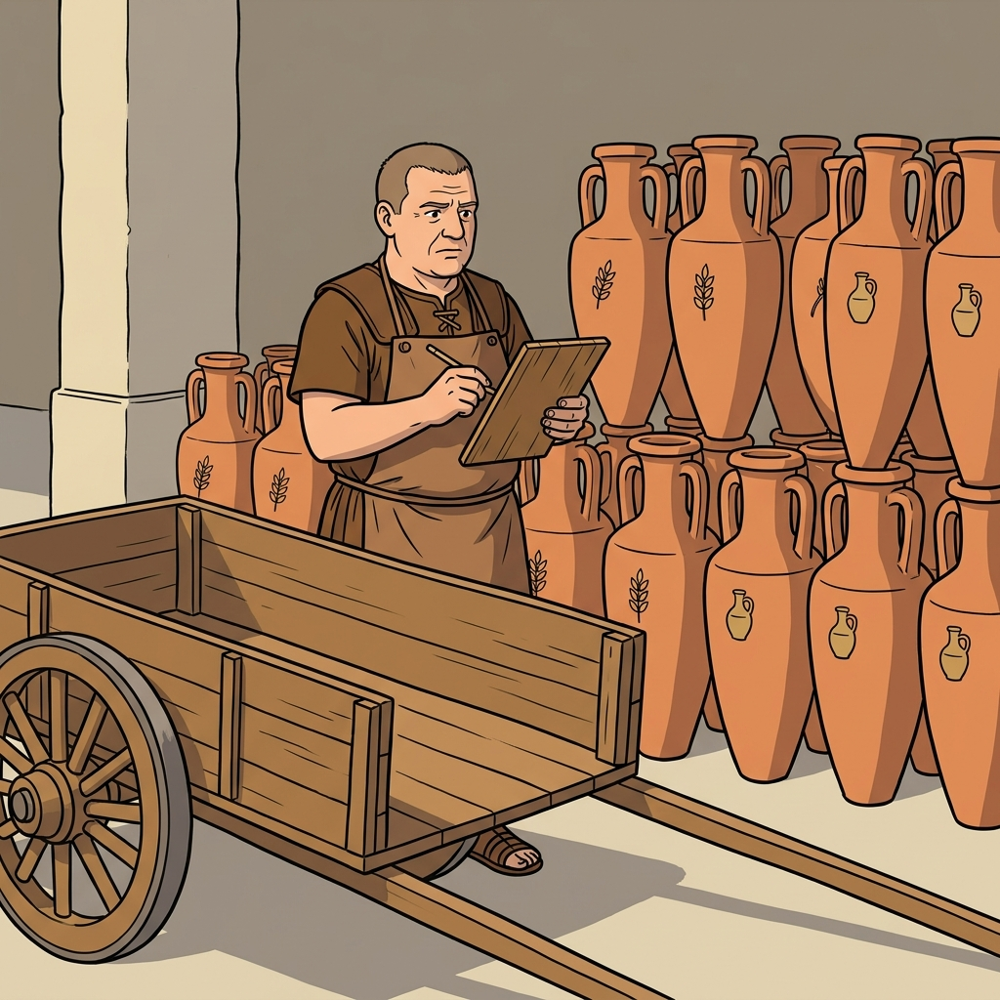
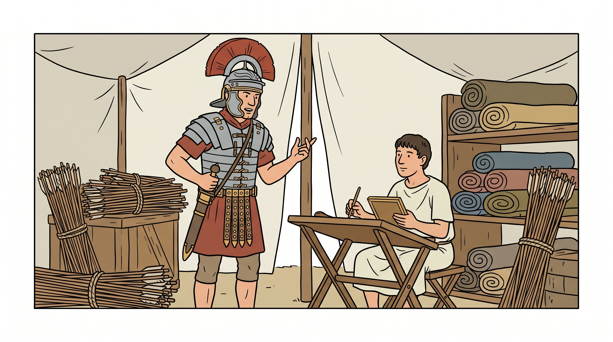
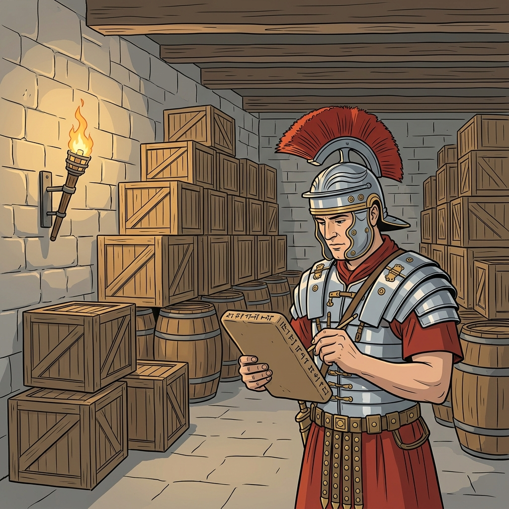
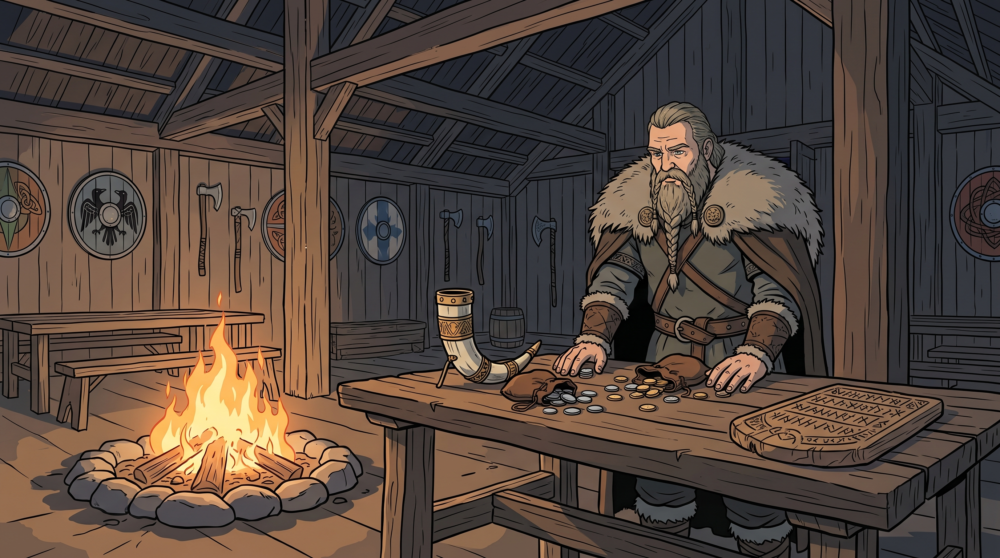
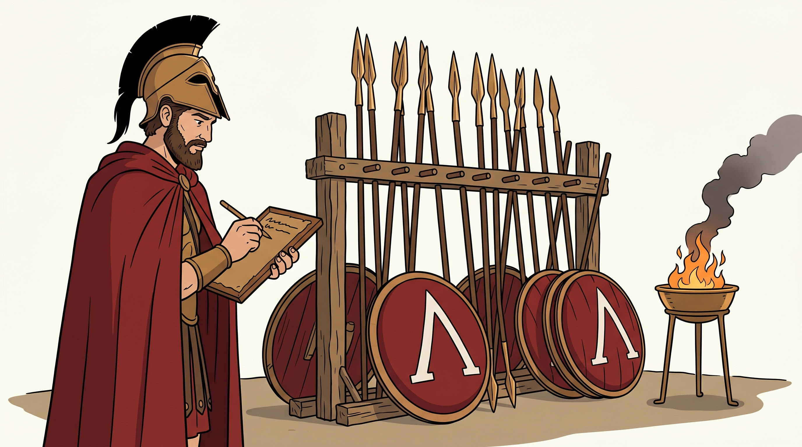
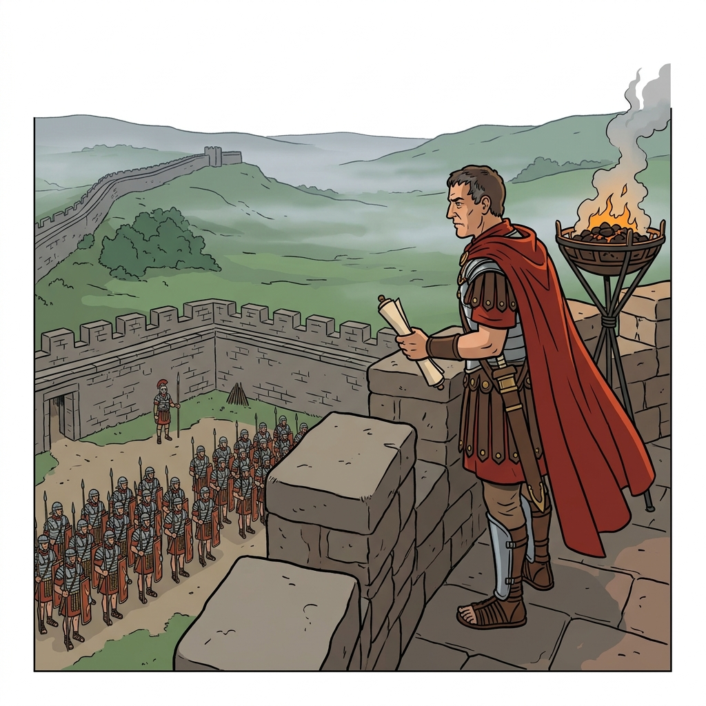

# My 12-Year-Old Asked If We Could Do More Math. I Think I Know Why.

*A working artifact of Chapter 5 of The Unscarcity Project. Built for one specific boy, now on GitHub for any parent who wants it.*

---

My youngest is twelve. He's what teachers politely call "people-smart": sharp with faces, sharper with jokes, the kind of kid who can read a room before he walks into it. He isn't, by any measure, math-smart.

He comes home from class looking a little lost. Not failing, exactly. Just… not arriving. The concepts glance off him. He says "I get it" when asked, and I can tell he doesn't. His teacher is good. His classroom has thirty-two other kids in it. The math is somewhere in the room, but it isn't in him.

I've spent the last two years writing a book about what education could be. It's called *The Unscarcity Project*. [Chapter 5](https://unscarcity.ai/a/chapter5) argues that the factory model of school, designed in 1843 Prussia to produce obedient soldiers and compliant bureaucrats, is finally obsolete. That every child in the post-scarcity world has a personal tutor: a Large Language Model taking the role Aristotle took for Alexander, one kid at a time, adapted to that kid's pace and passions.

> *"With Large Language Models, every child on Earth can have a personal Aristotle."*

I wrote that sentence in a chapter I was proud of. Then I watched my son struggle with fractions, and the sentence started to feel like it was looking at me.

So one weekend I stopped writing about it.

---

## The skeptic at the kitchen table

My wife was not enthusiastic. She has seen me start a lot of projects, and she has a finely-calibrated eyebrow that she deploys when she suspects the project might be for me more than for the kid.

*"You're going to write him math problems from a Greek philosopher?"*

*"Not me. The AI."*

The eyebrow went up a millimeter. She isn't wrong to be skeptical. The internet is full of edtech that promises transformation and delivers screen time. I told her we'd try it for two weeks and if it wasn't helping, we'd stop.

The tool I built is small. Every Tuesday it reads his Canvas grades, finds what he missed, and asks Claude to write him a two-page Socratic practice worksheet. It emails the PDF to him, the answer key to me. The whole thing runs on my laptop. It cost roughly nothing. It's on GitHub.

The first worksheet was competent and bland. He did the first problem, shrugged at the second, and asked if we were done. My wife's eyebrow did not move. It had the serenity of an eyebrow that had already been proven right.

Then I did the thing I should have done on day one. I wrote down what my kid actually cares about.

---

## The profile

He is obsessed with historical battles and military logistics. Not just the swords-and-glory part. The supply chains. The quartermasters. Who feeds an army of 5,000 men on a forced march through Gaul. What a Roman legion carries in its baggage train. Why Hannibal ran out of elephants. Whether Napoleon's retreat from Moscow was a logistical problem or a weather problem or a pride problem. (He has opinions.)

I put all of that in a file called `CHILD_PROFILE.md`. Three paragraphs on his interests, his cognitive style, what bores him, what lights him up. The next Tuesday, Aristotle pulled that file into the prompt.

The worksheet came back. Section A: *"You are the quartermaster of Legio IX Hispana. You have forty-eight amphorae of grain and thirty-six wagons of hay…"*

He read it. He did not shrug. He asked me what an amphora was.

The math was the same math that had been glancing off him all year: ratios, divisibility, greatest common factors. But now the numbers belonged to a Roman logistics officer, and Rome was a subject he had thoughts about. The math was no longer the point of the exercise. The exercise was about whether the quartermaster could feed his men. The math was the tool he had to reach for to find out.

That's not a pedagogical technique I invented. That's exactly what Chapter 5 asks for:

> *"Every meaningful breakthrough I witnessed came from someone who broke the rules the Prussian model was designed to enforce: someone who sat still when told to move, moved when told to sit, and asked the inconvenient question that everyone else politely ignored."*

My son had been sitting quietly in math class for months, doing exactly what the factory asked of him, and getting nothing. The first time I replaced the factory's scenario with one he actually cared about, he started asking inconvenient questions. *"What if the wagons are only half full? Do they still count as wagons?"* That's a GCF question hiding inside a history question. That's a citizen starting to form.

---

## The second shift: one image per exercise

The first version of the worksheet had one scenic illustration per section. It looked nice. He did not comment on it.

But I noticed he was spending a long time on the first problem and then speeding through the rest. When I asked why, he said the later problems felt "less real." The scenario at the top had faded from his mind by problem 3.

So I changed the tool. Now every single exercise gets its own illustration: a centurion at a warehouse, a Viking jarl counting silver, a Spartan inventorying spears, a Crusader knight at a siege engine. Same math, different decade, different world.

    

This is his favorite thing about the worksheet now. He said the images help him "see it," which I think is him describing immersion, the thing video games do for him and homework doesn't. He stares at the Viking jarl for thirty seconds before reading the problem. By the time he starts computing, he's already somewhere else.

It's pure Chapter 5:

> *"An AI can generate a technically perfect story, but it cannot decide if that story is one we should live by. Is this a story of courage or reckless pride? Justice or vengeance? Wisdom or cleverness? These aren't questions of data. They're questions of values."*

He's twelve. He isn't answering those questions yet. But he's learning that math is a thing you reach for when a story demands it. That's the shift. That's what the factory doesn't teach.

---

## Two moments that made my wife's eyebrow come down

The worksheet that week had five exercises in it. We sat at the kitchen table, I said we'd do a few and see how he felt, and we worked through problems one through three. I thought three was plenty. I started closing the PDF.

He stopped me. "Dad, I want to do all five." He wasn't performing for his mother. He wasn't trying to please me. He genuinely wanted to know how the story ended, which was, structurally, a word problem about how many strongbox keys a Crusader commander needed to distribute. But he wanted to know.

We did all five.

The next day was Sunday. We had gone on a long hike. I came home tired. I was ready to call it a day, flop on the couch, and forget that I had a kid who needed math practice.

He came to me first. He asked if we could do the second section of the worksheet. *"The one about the fort captain."*

The second section was a set of exercises where he had to play a Roman fort commander holding a position against barbarian raiders. Inequalities. How many soldiers per watchtower to maintain minimum strength. How long supplies would last under siege. Real sixth-grade math, wearing a scarlet cloak and standing on battlements in the fog.

My twelve-year-old, unprompted, tired from a hike, asked to do math with me.

My wife's eyebrow, at that moment, was level. She said nothing, which in her dialect is a kind of applause.

---

## Why I'm putting it on the internet

This isn't a breakthrough. Benjamin Bloom proved in 1984 that a kid with a one-on-one tutor outperforms 98% of their classroom peers. The effect has a name: the 2-sigma problem. "Problem" because there were 50 million kids and only so many Oxford dons. It wasn't a teaching problem. It was a scaling problem. And for forty-two years, it was unsolvable.

Large language models solved the scaling problem last Tuesday. Every kid can now have the tutor Bloom measured.

Chapter 5 argues that this isn't incremental. It's the end of the factory model and the beginning of something else. [Education: Factory vs. Citizen](https://unscarcity.ai/a/education-factory-vs-citizen) puts the irony more sharply than I managed to:

> *"We've trained an entire civilization to act like machines, and now the actual machines have arrived to do the job for real."*

We've been training kids to be inferior robots. We finally have real robots. What the kids should be trained for now is the part the robots can't do: the narrative judgment, the systems thinking, the agency that comes from actually building something. That's what a personal tutor, given infinite patience and perfect memory, is finally free to teach.

I built the tool for my son because I wrote Chapter 5 and I couldn't keep writing about the future of education while my own twelve-year-old was not getting it. But I'm putting it on GitHub because the tool costs nothing to run and it belongs to every parent who's sat at a kitchen table trying to explain fractions to a kid who would rather be reading about the Punic Wars.

The repo is [github.com/patdeg/aristotle](https://github.com/patdeg/aristotle). MIT license. About $100 a year to run (a domain name and a small email host). Two hours to set up if you're technical, an evening with a technical friend if you're not. I've documented every step.

Change the mentor's name if you want. Aristotle was my son's pick, but Socrates, Hypatia, Ada Lovelace, Confucius, Ibn Sina all fit. Change the subject too. Math is the default but it works for science, social studies, language arts, foreign language. Put your kid's actual passion in the profile file and let the worksheet meet them where they actually live.

The tool is small. The bet is not:

If we're wrong about the factory, if this isn't the end of it but just a rough patch, we lose nothing. Our kids get extra practice tailored to their interests. Worst case, a Sunday hike followed by an hour of Roman logistics with Dad.

If we're right, there's going to be a generation of kids who grew up with a tutor that actually saw them. Who learned that math is a tool you pick up when a story demands it. Who learned, at twelve, that it's okay to be curious about the inconvenient question.

My son hasn't turned into a math prodigy. He's twelve, and the worksheet is two pages once a week. But something moved. The eyebrow is still level. And the next time I was tired on a Sunday, I didn't have to ask.

---

*If this resonated, [read Chapter 5](https://unscarcity.ai/a/chapter5) of *The Unscarcity Project*. It's about 25 minutes and it will change how you think about what your kid's school is actually for.*

*[github.com/patdeg/aristotle](https://github.com/patdeg/aristotle). MIT licensed, free forever. Pull requests welcome from any parent who wants to share what worked for their kid.*

---

### The book

*Unscarcity: The Blueprint to Rebuild Society for a World Run by Machines* is the full argument this project draws on. Chapter 5 is the education chapter; the other thirty-odd chapters cover what happens to work, governance, meaning, identity, and citizenship when intelligence stops being scarce.

- 🌐 Read free online at **[unscarcity.ai](https://unscarcity.ai)** (full text, chapter by chapter)
- 📚 Hardcover / paperback on [**Amazon**](https://www.amazon.com/dp/1945061715)
- 📖 Kindle edition on [**Amazon**](https://www.amazon.com/dp/B0GB11PZVX)
- 🎧 [**Audiobook on Spotify**](https://open.spotify.com/show/6tLMdecf50XeHyFgDwsKmZ)
- 🎙️ Companion podcast [**Minds, Bodies & Terawatts**](https://open.spotify.com/show/5tK6RXxsrcWzcKY8Wq9jiK) on Spotify, weekly deep-dives on topics the book only has space to introduce

---

### Further reading from *The Unscarcity Project*

- [Chapter 5: The Education of a Citizen](https://unscarcity.ai/a/chapter5)
- [Education: Factory vs. Citizen](https://unscarcity.ai/a/education-factory-vs-citizen)
- [Gen Z and the Human Edge](https://unscarcity.ai/a/gen-z-human-edge)
- [Agentic AI & Orchestration](https://unscarcity.ai/a/agentic-ai-orchestration)
- [Four Living Pillars](https://unscarcity.ai/a/four-living-pillars)
